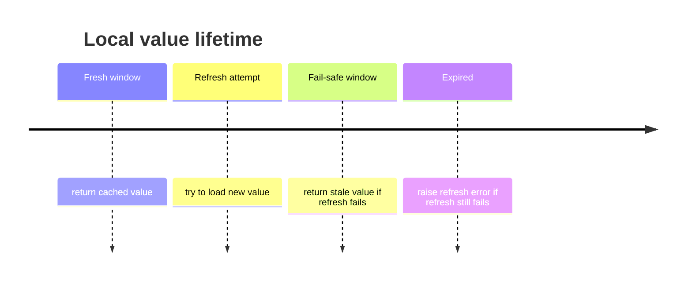

# Fail-safe Stale Reads

Fail-safe stale reads let your application keep serving the last local value when a refresh fails.

Each local entry has two deadlines:

| Deadline | Meaning |
| --- | --- |
| Fresh until | Normal cache lifetime from `ttl_seconds` |
| Fail-safe until | Extra stale window from `fail_safe_seconds` |

After the fresh lifetime expires, `Async Hybrid Cache` tries to refresh the value. If the refresh raises an exception or times out and the stale value is still inside the fail-safe window, the stale value is returned.

If there is no stale value, or the fail-safe window has also expired, the refresh error is raised.
