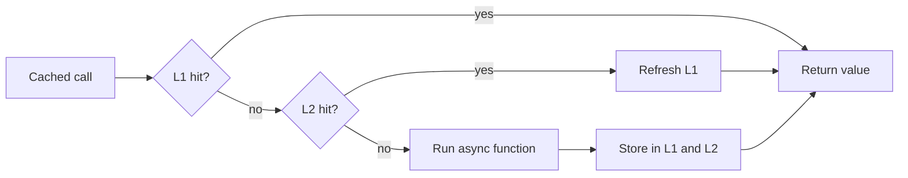

# L1 and L2 Caching

`Async Hybrid Cache` reads values in this order:

The L1 cache is inside each application process. It is the fastest place to read from, but each process has its own local copy.

The optional L2 cache stores shared values. Redis and Memcached are the distributed cache providers. L2 helps multiple application instances reuse the same cached value without each instance recomputing it.

When a value is missing or expired in L1, `Async Hybrid Cache` checks L2 if configured. If L2 has a value, the local L1 cache is refreshed from that value. If L2 misses, the wrapped async function or factory runs and the new value is stored.
