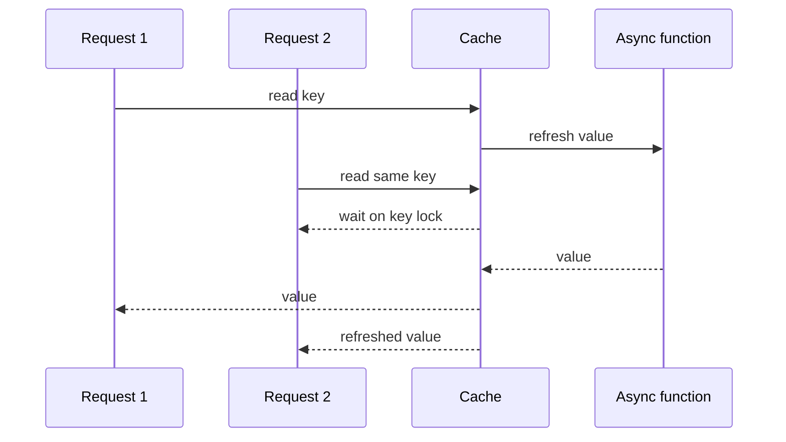

# Stampede Protection

When many requests ask for the same expired or missing key at once, `Async Hybrid Cache` uses one async lock per key.

The first request for that key refreshes the value. Other requests wait for the same refresh instead of running duplicate work. After the refresh completes, waiting requests read the refreshed value.

This is most useful for expensive calls such as API requests, database queries, or computed responses where many concurrent requests can target the same key.
